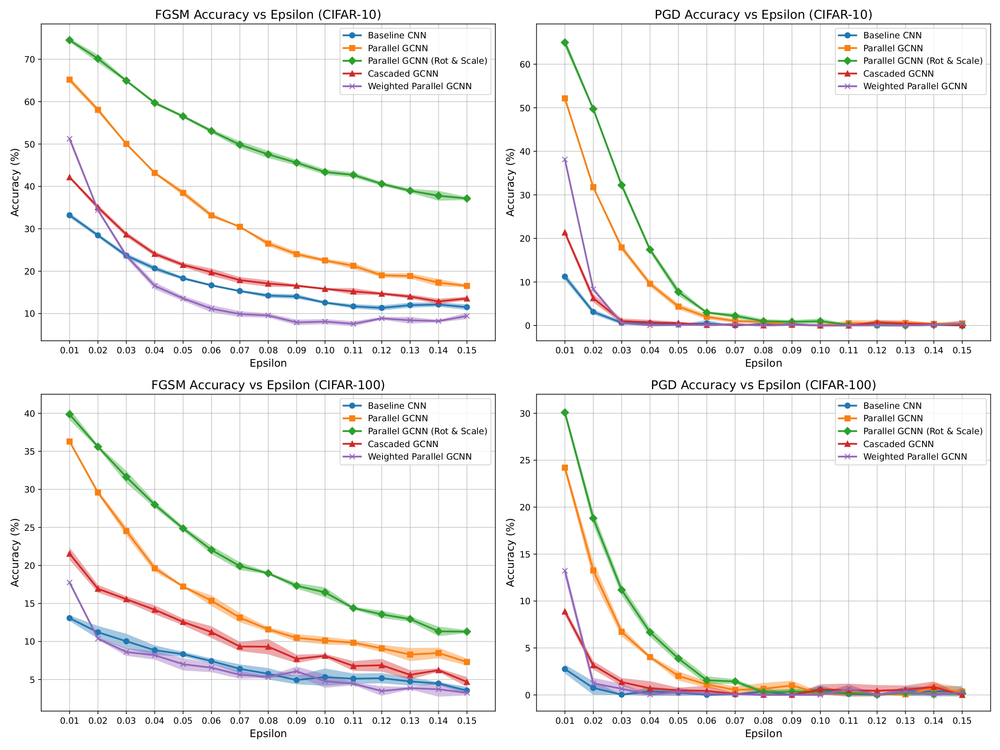
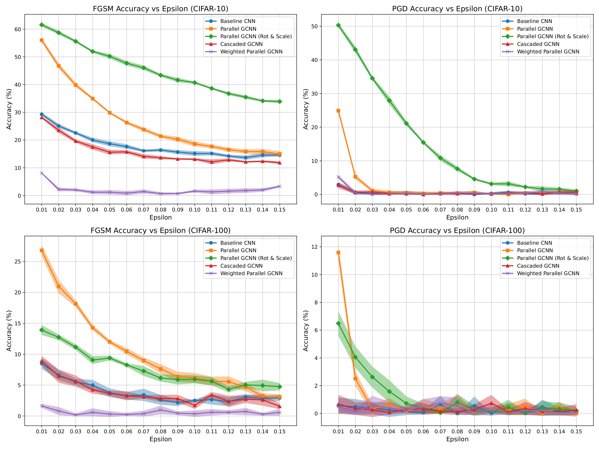
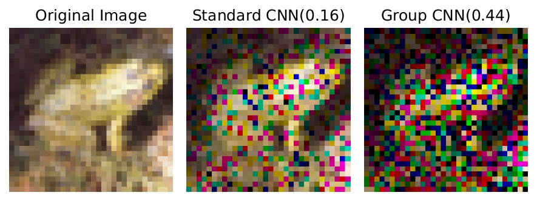
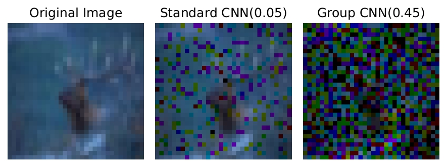
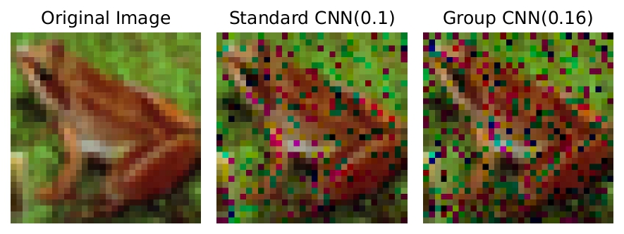

# Bridging Symmetry and Robustness: On the Role of Equivariance in Enhancing Adversarial Robustness

This repository is the official implementation of our NeurIPS 2025 paper **"Bridging Symmetry and Robustness: On the Role of Equivariance in Enhancing Adversarial Robustness"**.

## Abstract

Adversarial examples reveal critical vulnerabilities in deep neural networks by exploiting their sensitivity to imperceptible input perturbations. While adversarial training remains the predominant defense strategy, it often incurs significant computational cost and may compromise clean-data accuracy. In this work, we investigate an architectural approach to adversarial robustness by embedding group-equivariant convolutions—specifically, rotation- and scale-equivariant layers—into standard convolutional neural networks (CNNs). These layers encode symmetry priors that align model behavior with structured transformations in the input space, promoting smoother decision boundaries and greater resilience to adversarial attacks. We propose and evaluate two symmetry-aware architectures: a parallel design that processes standard and equivariant features independently before fusion, and a cascaded design that applies equivariant operations sequentially. Theoretically, we demonstrate that such models reduce hypothesis space complexity, regularize gradients, and yield tighter certified robustness bounds under the CLEVER (Cross Lipschitz Extreme Value for nEtwork Robustness) framework. Empirically, our models consistently improve adversarial robustness and generalization across CIFAR-10, CIFAR-100, and CIFAR-10C under both FGSM and PGD attacks, without requiring adversarial training. These findings underscore the potential of symmetry-enforcing architectures as efficient and principled alternatives to data augmentation-based defenses.

## Key Highlights

✨ **Architectural Defense**: Achieve adversarial robustness through symmetry priors, without adversarial training  
🎯 **Strong Performance**: 2-3x improvement over baseline CNNs under PGD attacks  
📊 **Comprehensive Evaluation**: Tested on CIFAR-10, CIFAR-100, and CIFAR-10C  
🔬 **Theoretical Guarantees**: Tighter CLEVER-certified robustness bounds via orbit-invariant gradients  

## Citation

If you find this work useful in your research, please consider citing:
```bibtex
@article{wang2025bridging,
  title={Bridging Symmetry and Robustness: On the Role of Equivariance in Enhancing Adversarial Robustness},
  author={Wang, Longwei and Uddin, Ifrat Ikhtear and Santosh, KC and Zhang, Chaowei and Qin, Xiao and Zhou, Yang},
  journal={arXiv preprint arXiv:2510.16171},
  year={2025}
}
```

## Requirements

To install requirements:

```setup
pip install -r requirements.txt
```

>📋  
### Project Structure

The project directory contains the following key folders:

- **cifar10**, **cifar100**, **cifar10c**: Each of these folders contains multiple `.py` files that run experiments using the corresponding dataset. These scripts include training a baseline model as well as a model with our proposed architecture to enhance robustness.

- **dataset**: This folder contains the **CIFAR-10-C** dataset used in the experiments.

### Running the Experiments

We will guide you through how to run each experiment using the corresponding dataset, from training to evaluating the model's robustness.


### Training Models on different Datasets

To train both the baseline model and our proposed models (`Parallel GCNN`, `Parallel GCNN with Rotation- and Scale-Equivariant`, `Cascaded GCNN` and `Weighted Parallel GCNN`) on the CIFAR-10 dataset, navigate to the cifar10 folder and run the corresponding script using the following command:
```
├── baselineCNN10layer_cifar10.py
├── cascadedGCNN10layer_cifar10.py
├── parallelGCNN10layer_cifar10_no_aug.py
├── parallelGCNNrotscale10layer_cifar10.py
└── weightedGCNNrotscale10layer_cifar10.py
```

```train
python filename.py
```
Running each of these scripts will train the baseline model as well as the four proposed models on the CIFAR-10 dataset. Similarly, to train the corresponding models on the CIFAR-100 dataset, run the scripts below while in cifar100 folder:

```
├── baselineCNN10layer_cifar100.py
├── cascadedGCNN10layer_cifar100.py
├── parallelGCNN10layer_cifar100_no_aug.py
├── parallelGCNNrotscale10layer_cifar100.py
└── weightedGCNNrotscale10layer_cifar100.py
```

## Evaluation

We evaluate robustness of our models under FGSM and PGD attack and compare the perfomance with our proposed models with the basic baseline model

Evaluation files for CIFAR10:
```
├── baselineCNN10layer_cifar10_test.py
├── cascadedGCNN10layer_cifar10_test.py
├── parallelGCNN10layer_cifar10_no_aug.py
├── parallelGCNNrotscale10layer_cifar10_test.py
├── weightedGCNNrotscale10layer_cifar10_test.py
```
Evaluation files for CIFAR100:
```
├── baselineCNN10layer_cifar100_test.py
├── cascadedGCNN10layer_cifar100_test.py
├── parallelGCNN10layer_cifar100_no_aug.py
├── parallelGCNNrotscale10layer_cifar100_test.py
├── weightedGCNNrotscale10layer_cifar100_test.py
```
Evaluation files for CIFAR10C:
```
├── baselineCNN10layer_cifar10c_test.py
├── cascadedGCNN10layer_cifar10c_test.py
├── parallelGCNN10layer_cifar10c_test.py
├── parallelGCNNrotscale10layer_cifar10c.py
└── weightedGCNNrotscale10layer_cifar10c.py
```

run any of the following file by going into the corresponding directory using the command
```eval
python filename.py
```

**Note**: Running the file `parallelGCNN10layer_cifar100_no_aug.py` and `parallelGCNN10layer_cifar100_no_aug.py` will train and evaluate the saved model all in one. If you want to just test, comment out the training block of the code.
## Pre-trained Models

You can download pretrained models here:
In the `models` folder there some pretrained model that gave us the experiment results we have shown in the paper. You can download and use the pretrained model to generate the results, all you have to do is make sure our test file code loads the model from correct path. 

Models trained on CIFAR10 are in `cifar10_models` folder and similary CIFAR100 models are `cifar100_models` folder.

## Results
Running the evaluation/test python scripts will generate CSV file with test results based on these data Figures and Tables in the paper are generated. We compare our proposed models perfomance with regular CNN architectured model which we are calling Baseline Model. 








To generate visualization run, Make sure you corrected the models path 

```visual
python visual/visualization.py
```

